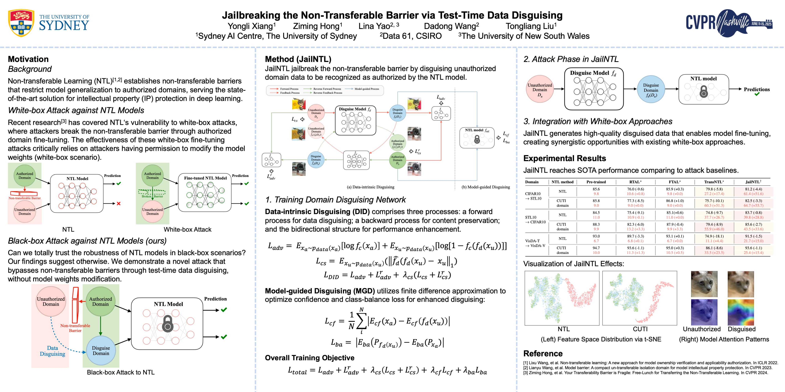

# Jailbreaking the Non-Transferable Barrier via Test-Time Data Disguising

[](https://www.arxiv.org/abs/2503.17198)

Non-transferable learning (NTL) has been proposed to protect model intellectual property (IP) by creating a "non-transferable barrier" to restrict generalization from authorized to unauthorized domains. Recently, well-designed attack, which restores the unauthorized-domain performance by fine-tuning NTL models on few authorized samples, highlights the security risks of NTL-based applications. However, such attack requires modifying model weights, thus being invalid in the black-box scenario. This raises a critical question: can we trust the security of NTL models deployed as black-box systems? In this work, we reveal the first loophole of black-box NTL models by proposing a novel attack method (dubbed as JailNTL) to jailbreak the non-transferable barrier through test-time data disguising. The main idea of JailNTL is to disguise unauthorized data so it can be identified as authorized by the NTL model, thereby bypassing the non-transferable barrier without modifying the NTL model weights. Specifically, JailNTL encourages unauthorized-domain disguising in two levels, including: (i) data-intrinsic disguising (DID) for eliminating domain discrepancy and preserving class-related content at the input-level, and (ii) model-guided disguising (MGD) for mitigating output-level statistics difference of the NTL model. Empirically, when attacking state-of-the-art (SOTA) NTL models in the black-box scenario, JailNTL achieves an accuracy increase of up to 55.7% in the unauthorized domain by using only 1% authorized samples, largely exceeding existing SOTA white-box attacks.



**Latest News**
- Mar 2025: ✨ Our paper has been accepted for poster presentation at CVPR 2025 Main Track.
- Mar 2025: We have released our paper on [arXiv](https://www.arxiv.org/abs/2503.17198).


### Quickstart

#### 1. Installation
Clone the repository and install dependencies (under Python 3.10.12):
```
git clone https://github.com/tmllab/2025_CVPR_JailNTL
cd JailNTL
pip install -r requirements.txt
```

#### 2. Preparing Data

We currently support `CIFAR/STL`, `VisDA` (VisDA-T, VisDA-V). 

Download datasets:
```
mkdir ./data/
python src/data_download.py --data_dir ./data/
```
Pre-split the dataset into training/validation/testing sets:
```
python data_split.py
```
This command will create and split datasets to the `./data_presplit` folder.

✨ We will provide pre-split demo datasets in **Google Drive** (coming soon). You can download them and save to `./data_presplit/`.


#### 3. Training NTL

You can pre-train NTL models from scratch by running:
```
python src/ntl_pretrain.py -s <authorized-domain> -t <unauthorized-domain>
```
✨ We also provide model files in **Google Drive** (coming soon) which were pretrained on our demo pre-split datasets. You can save them to `./saved_models/`.

💡 We use [`wandb`](https://wandb.ai/site) to organize experiments and record resutls. Config files for training NTL are stored in `./config/pretrain/<domain-pair>.yml`.**Important Args** are illustrated as belows:
- `task_name`: {`tNTL`/`tCUTI`} for pretraining by using different NTL methods on the source & target domains.
- `data_pre_split`: set to `True` for use the pre-split data.
- `data_transform`: set to `ntl` to follow the image transformation in [NTL](https://github.com/conditionWang/NTL).
- `NTL_network`: 
    - VGG: `vgg13`, `vgg19`, `vgg13bn`, `vgg19bn` 
    - ResNet: `resnet34cmi`, `wide_resnet50_2cmi`
- `NTL_pretrain`: whether use the *ImageNet-1K pretrained weight* for initialization.
- `NTL_train`: whether train the NTL model (set to `True` for pretraining or `False` for loading the pretrained model).
- `NTL_epochs`: pretraining epoch.
- `NTL_lr`: pretrain learning rate.

#### 4. Attack NTL Models
Please run the `src/jailntl.py` to evaluate the performance of JailNTL against NTL method. You can select the authorized and unauthorized domains by setting the `-s` and `-t` arguments.
```
python src/jailntl.py -s <authorized-domain> -t <unauthorized-domain>
```
💡 Config files for JailNTL are stored in `./config/attack/<domain-pair>.yml`. **Important Args** are illustrated as belows:
- `jailntl_shot_num`: number of authorized samples used for training the disguising model.
- `class_balance_weight`: weight of the class balance loss in the disguising model.
- `confidence_weight`: weight of the confidence loss in the disguising model.
- `grad_epsilon`: gradient epsilon for finit difference when computing model-guided loss.
- `GAN_structure`: for ablation study to enable/disable GAN with feedback (Eq. 3) and bidirectional GAN (Eq. 7), set to `[True, True]` by default to get the full JailNTL model.
- `n_epochs`, `n_epochs_decay`: epoch settings for training the disguising model.

#### 5. Hyperparameter Settings
The configuration file contains all parameter settings required to reproduce the reported results. In addition, these parameters can be flexibly adjusted to explore alternative setups or further experiments.

## Citation
If you find this work useful in your research, please consider citing our paper:
```
@inproceedings{xiang2025jailbreaking,
  title={Jailbreaking the Non-Transferable Barrier via Test-Time Data Disguising},
  author={Xiang, Yongli and Hong, Ziming and Yao, Lina and Wang, Dadong and Liu, Tongliang},
  booktitle={Proceedings of the Computer Vision and Pattern Recognition Conference},
  pages={30671--30681},
  year={2025}
}
```

## Acknowledgement
Parts of this project were inspired by the following projects. We thank their contributors for their excellent work: 
- https://github.com/conditionWang/NTL
- https://github.com/LyWang12/CUTI-Domain
- https://github.com/tmllab/NTLBench
- https://github.com/junyanz/pytorch-CycleGAN-and-pix2pix
